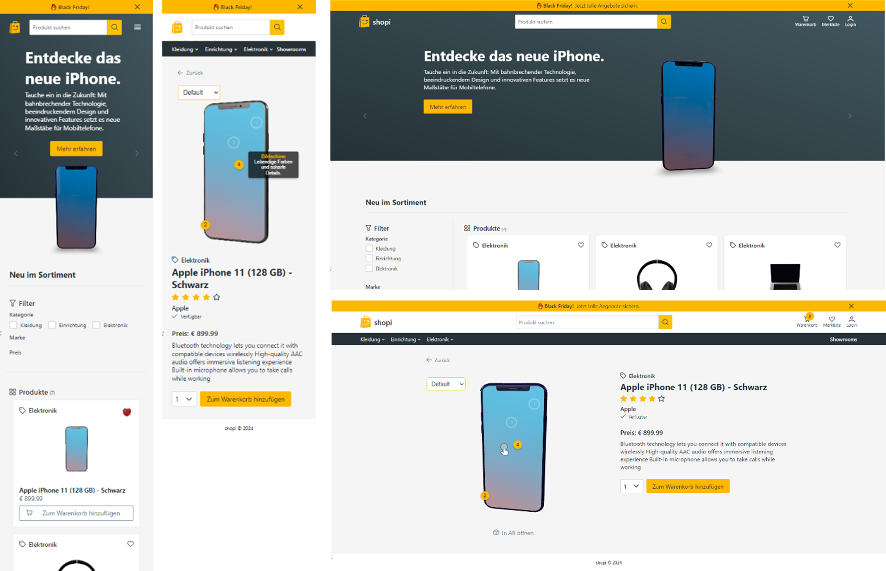

# Shopi-Frontend

This is where the magic 🧙‍♂️ happens. Leveraging **React Three Fiber** and Google's **Model-Viewer**, 3D models are integrated at different points and in various ways, creating a novel form of interaction.

## Pages
The most important pages are:
- Home Page
- Product Page
- Cart Page
- Wishlist Page

(Experimental: Showroom Page)

## Frontend-Tools

- React, Vite & Typescript
- React Three Fiber
- Drei
- Model Viewer
- Eslint & Stylelint
- Primereact, Primeflex & PrimeIcons
- Prettier
